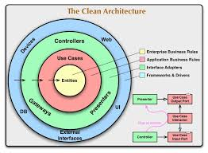

# Clean Architecture Node.js REST API Example

<div style="width:100%; text-align:center">
  
</div>

**Objective:**
> This project demonstrates how to apply Uncle Bob's Clean Architecture principles in a Node.js REST API. It is designed as an educational resource to help developers structure their projects for maximum testability, maintainability, and scalability. The codebase shows how to keep business logic independent from frameworks, databases, and delivery mechanisms.

## Stack
- **Node.js** (Express.js) for the REST API
- **MongoDB** (native driver) for persistence
- **Jest** & **Supertest** for unit and integration testing
- **ESLint** & **Prettier** for linting and formatting
- **Docker** & **Docker Compose** for containerization
- **GitHub Actions** for CI/CD

## Why Clean Architecture?
- **Separation of Concerns:** Each layer has a single responsibility and is independent from others.
- **Dependency Rule:** Data and control flow from outer layers (e.g., routes/controllers) to inner layers (use cases, domain), never the reverse. Lower layers are unaware of upper layers.
- **Testability:** Business logic can be tested in isolation by injecting dependencies (e.g., mock DB handlers) from above. No real database is needed for unit tests.
- **Security & Flexibility:** Infrastructure (DB, frameworks) can be swapped without touching business logic.

## How Testing Works
- **Unit tests** inject mocks for all dependencies (DB, loggers, etc.) into use cases and controllers. This means you can test all business logic without a real database or server.
- **Integration tests** can use a real or in-memory database, but the architecture allows you to swap these easily.
- **Example:**
  - The product use case receives a `createProductDbHandler` as a parameter. In production, this is the real DB handler; in tests, it's a mock function.
  - Lower layers (domain, use cases) never import or reference Express, MongoDB, or any framework code.

## Project Structure
```
enterprise-business-rules/
  entities/           # Domain models (User, Product, Rating, Blog)
  validate-models/    # Validation logic for domain models
application-business-rules/
  use-cases/          # Application use cases (products, user, blog)
interface-adapters/
  controllers/        # Route controllers for products, users, blogs
  database-access/    # DB connection and data access logic
  adapter/            # Adapters (e.g., request/response)
  middlewares/        # Auth, logging, error handling
routes/               # Express route definitions
public/               # Static files and HTML views
```

## Getting Started

### Prerequisites
- Node.js (v18+ recommended)
- MongoDB instance (local or cloud)

### Installation
1. Clone the repository:
   ```bash
   git clone <repo-url>
   cd Clean-code-arch-REST-API
   ```
2. Install dependencies:
   ```bash
   yarn install
   ```
3. Create a `.env` file in the root with your environment variables:
   ```env
   PORT=5000
   MONGO_URI=mongodb://localhost:27017/your-db
   JWT_SECRET=your_jwt_secret
   ```
4. Start the server:
   ```bash
   yarn dev
   # or
   yarn start
   ```

## API Endpoints
See the `routes/` directory for all endpoints. Example:
- `POST   /products/` - Create a new product
- `GET    /products/` - Get all products
- `POST   /users/register` - Register a new user
- `POST   /users/login` - User login
- `GET    /blogs/` - Get all blogs

## API Documentation & Models (Swagger UI)
- Interactive API docs are available at `/api-docs` when the server is running.
- All endpoints are documented with request/response schemas using Swagger/OpenAPI.
- **Models:**
  - Each resource (User, Product, Blog) has two main schemas:
    - **Input Model** (e.g., `UserInput`, `ProductInput`, `BlogInput`): What the client sends when creating or updating a resource. Only includes fields the client can set (e.g., no `_id`, no server-generated fields).
    - **Output Model** (e.g., `User`, `Product`, `Blog`): What the API returns. Includes all fields, including those generated by the server (e.g., `_id`, `role`, etc.).
- This separation improves security, clarity, and validation.
- You can view and try all models in the "Schemas" section of Swagger UI.

## Testing
- **Unit tests** (Jest): Test business logic in isolation by injecting mocks for all dependencies. No real DB required.
- **Integration tests** (Supertest): Test the full stack, optionally with a real or in-memory DB.
- To run all tests:
  ```bash
  yarn test
  ```
- Test files are in the `tests/` directory.

## Linting & Formatting
- Lint your code:
  ```bash
  yarn lint
  ```
- Format your code:
  ```bash
  yarn format
  ```
- Prettier and ESLint are enforced on pre-push via Husky and lint-staged.

## Docker & Docker Compose
- Build and run the app with MongoDB using Docker Compose:
  ```bash
  docker-compose up --build
  ```
- The app will be available at [http://localhost:5000](http://localhost:5000).
- The MongoDB service runs at `mongodb://mongo:27017/cleanarchdb` (inside Docker) or `localhost:27017` (locally).
- To stop and remove containers, networks, and volumes:
  ```bash
  docker-compose down -v
  ```

## CI/CD Workflow
- GitHub Actions workflow is set up in `.github/workflows/ci-cd.yml`.
- On push to `main`, the workflow lints, tests, builds, and pushes a Docker image.

## Troubleshooting
- See [troubleshooting.md](./troubleshooting.md) for common issues and solutions.

## License
ISC License. See [LICENSE](LICENSE).
